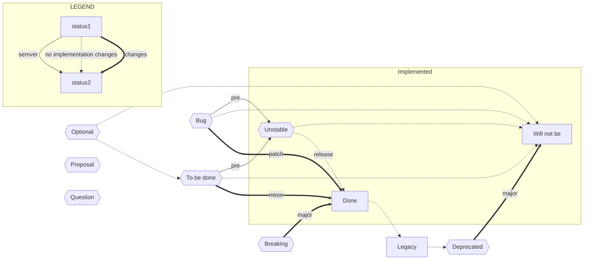

## Suite Statuses/Stages

| Abbr      | Description | Now      | [Modal](https://www.ietf.org/rfc/rfc2119.txt) | Fut            | Changes     | Args |
| --------- | ----------- | -------- | -------------- | --------- | --------- | --------- |
| `DONE`    | Implemented | `X => Y` | MUST   | `X => Y`       | N      | 2     |
| `LEG` | Legacy  | `X => Y` | SHOULD | `X => Y` | N | 2 |
| `DEPR`    | Deprecated  | `X => Y` | SHOULD NOT | `X !> Y` `N ?> Y` `X ?> Z` | I/O | 2-4 |
| `WONT` | Will Not Be | `X !> Y` | MUST NOT | `X !> Y` | N | 2 |
| `TBD` | To be done | `X !> Y` `X ?> Z` | SHOULD | `X => Y` | O | 2-3 |
| `BUG+` | Bug | `X !> Y` `X => Z` | MUST | `X => Y` | O | 3 |
| `BUG-` | Bug | `X => Y` `X ?> Z` | MUST | `X !> Y` `X ?> Z` | O | 2-3 |
| `UNST` | Unstable | `X => Y` | MAY | `X !> Y` | O | 2 |
| `OPT` | Optional | `X !> Y`  `X ?> Z` | MAY | `X => Y` | O | 2-3 |
| `PROP` | Proposal | `X => Y` `N => Z` | MAY | `X => Z` `N => Y` | IO | 4 |
| `BRK` | Breaking |  |  |  |  |  |
| `QUES` | Question | `? => Y` | *how* | `X => Y` | I | 1 |

